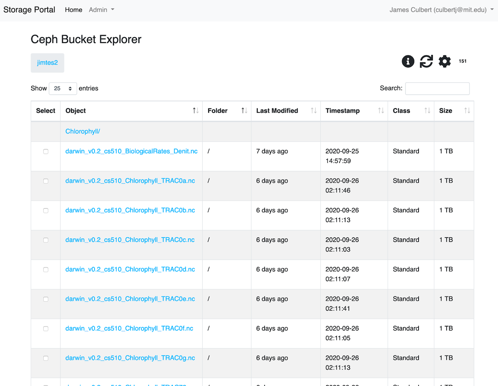

Accessing Datasets
==================

OSN supports a RESTful API that is compatible with the basic data access model of the 
`Amazon S3 API <https://docs.aws.amazon.com/AmazonS3/latest/API/Welcome.html>`_.
Any software that complies with that API can access data stored on the OSN.

There are three common methods for connecting to and using OSN resources:

#. OSN portal built-in web tools
#. Third party desktop applications (e.g. Cyberduck, Rclone)
#. Third party data management server applications (e.g. Globus and iRods)

OSN Portal Built-in Web Tools
-----------------------------
The OSN portal (`portal.osn.xsede.org <http://portal.osn.xsede.org>`_) supports
a simple UI that allows end users to browse allocations and to upload and 
download objects via the browser. This mode of access is most appropriate for 
browsing a dataset and uploading/downloading smaller files (typically <100G).

To use the built-in browser, a user logs onto the OSN portal and clicks on one
of the allocations that they have been granted access to. This brings the user
to a searchable/sortable table listing of the allocation and its subdirectories.
Clicking on any of the objects shown initiates a download of the object to the local disk.

To upload a file, the user locates the file on their local filesystem and drags the file to the browser window. This initiates an upload to the bucket location that the user is currently browsing.

OSN Basic Bucket Browser
^^^^^^^^^^^^^^^^^^^^^^^^

  OSN Basic Bucket Explorer

Third Party Applications
------------------------

Cyberduck
^^^^^^^^^
This is Cyberduck

Rclone
^^^^^^^

Third Party Data Management
---------------------------

